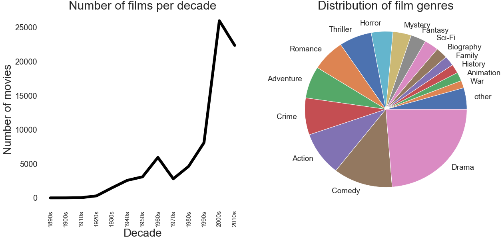

__Are films getting too simple; full of short sentences and predictable plots, catering to an attention-deficit audience? Is it true that contemporary films have a lot more profanity than the old ones? And finally, do people like happy or sad endings?__

These are the questions we want to answer. We have a lot of data: 25GB of film subtitles from the 1900s to 2018, retrieved from the website [OpenSubtitles](https://www.opensubtitles.com/en). With a careful analysis of this data, we can provide answers for the given questions, and many other things. And hopefully we can have some fun along the way.

### Our Data

Before starting the analysis, it is important to give some main facts about our dataset. If the data is bad - the conclusion will be bad, so we will try to see why our data can lead to a certain bias.

As we can see on the left plot above, we mostly have newer films in our dataset. Every time we do an analysis of some film property by decade, you must know that the analysis we are much sure for 

Most interesting desc stats
(duration per decade, etc)

### The Lowest Common Denominator

Films are generally expensive to make, and are made primarly for profit. But how can your movie sell well if most people don't understand it? Your film might be a stroke of genius, but general audience might be more interested in toilet humor than your intelectual rambling. Many cinemaphiles claim this is reason why most movies are "dumbed-down", and this phenomenon is generally known as the [lowest common denominator](https://tvtropes.org/pmwiki/pmwiki.php/Main/LowestCommonDenominator). 

### The F-bombs

Scorsese's _The Wolf of Wall Street_ broke the all-time record for number of f-words in a movie: the word was used a whooping 506 times. That is more than 9 f-words used every minute! However, this is just one example. Are newer films in general containing more and more offensive language?

### And They Lived Happily Ever After

Earth was saved from the alien threat, the cavlary has arrived, the hero got the girl, and the couple finally got together after they realized all of their differences were just misunderstandings. Films in general often have a positive tone and a happy ending; after all, people have enough sadness in their real life. But too much happy endings and they can become annoying, and some even say [unhealthy](https://www.gamesradar.com/happy-endings-to-movies-are-secretly-unhealthy-but-we-keep-falling-for-them-hook-line-and-sinker/). We will check out if it is truly a fact that we have more happy movies today, and also find out which genres to avoid if you desire some realism.

### How to Make a Blockbuster

You now know that films are pretty readable, that swear words will soon become more common than non-swear words, and that romance movies are sappy. But what is the worth of knowledge if you can't use it to make some money? In this section, we will look at the three film properties we already analyzed (complexity, number of offensive words, sentiment) and try to find correlation between them and movie ratings.

---

__Thank you for reading__. We hope you enjoyed our story. 

__Authors:__ Jakob Svenningsson and Robert Injac

Code used for making this data story is available [on GitHub](https://github.com/RobertInjac/ADA-Project-2018-OpenSubtitles).